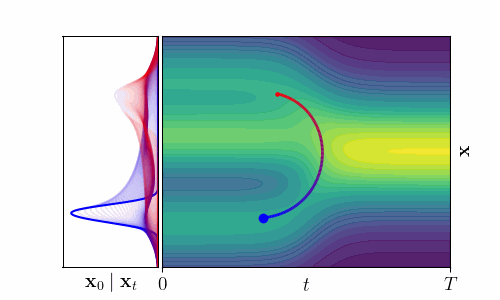

# Spacetime Geometry of Denoising in Diffusion Models


This repository contains the implementation of [Spacetime Geometry of Denoising in Diffusion Models](https://arxiv.org/abs/2505.17517). If you find our work useful in your research, please consider citing (expand for BibTeX):

<details>
<summary>
R. Karczewski, M. Heinonen, A. Pouplin, S. Hauberg, V. Garg. Spacetime Geometry of Denoising in Diffusion Models
</summary>

```bibtex
@article{karczewski2025spacetime,
  title={Spacetime Geometry of Denoising in Diffusion Models},
  author={Karczewski, Rafa{\l} and Heinonen, Markus and Pouplin, Alison and Hauberg, S{\o}ren and Garg, Vikas},
  journal={arXiv preprint arXiv:2505.17517},
  year={2025}
}
```
</details>

### TL;DR

We redefine the latent space of diffusion models as a spacetime continuum $(\mathbf{x}_t,t)$. Using ideas from information geometry, we impose a geometric structure that captures how the denoising distribution changes as we move through latent spacetime. Surprisingly, we can compute shortest paths efficiently—even in high dimensions.

|  | 
|:--:| 
| **Fig1: Spacetime geodesic is the shortest path between denoising distributions.** Each point on the spacetime curve $(\mathbf{x}_t,t)$ (right) corresponds to a denoising distribution $p(\mathbf{x}_0 \mid \mathbf{x}_t)$ (left).|
---
### Code structure
Each directory contains instructions on how to set up the necessary environment, and how to run code to reproduce results from the paper.

#### Toy experiments

This directory contains experiments on the toy experiments with 1D Gaussian mixture. These include code necessary to recreate Fig1 and Fig5 (left).

#### Image experiments

This directory contains experiments on image data using the EDM2 model. These are discussed in Section 3.4.

#### Molecular experiments

This directory contains experiments on transition path sampling for molecular data, as discussed in Sections 4.2 and 4.3 in the paper.
